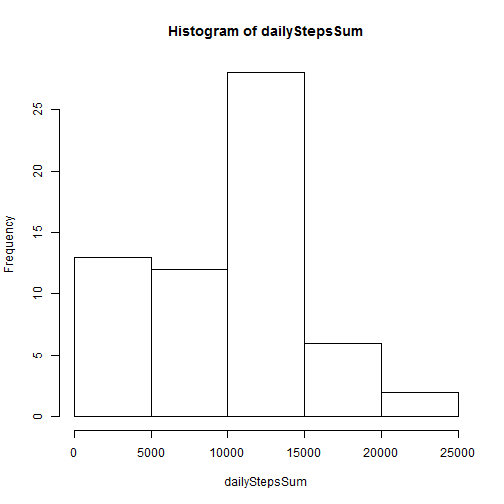
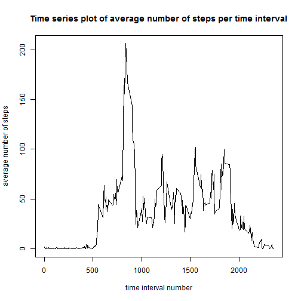
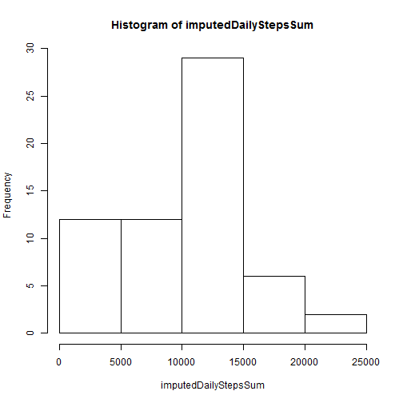
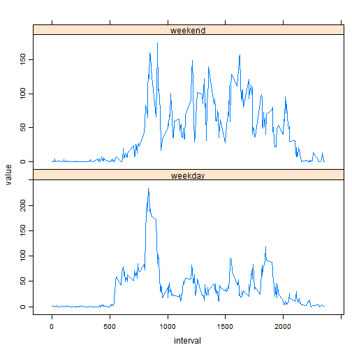

# Reproducible Research: Peer Assessment 1

The only problem with this data set is that the intervals between 55 and 100 are missing in all days!!

I need some extra libraries that must be loaded. 

```r
if(!is.element('reshape', installed.packages()[,1]))
{install.packages('reshape')
}
if(!is.element('lattice', installed.packages()[,1]))
{install.packages('lattice')
}
library(reshape)
library(lattice)
```

## Loading and preprocessing the data

read the activity data into actData variable 

```r
actData<-read.csv("activity.csv")
```

separate "interval", "steps" and "date" attributes for future purposes

```r
steps<-actData[, "steps"]
dates<-actData[, "date"]
intervals<-actData[, "interval"]
```

## What is mean total number of steps taken per day?

to compute mean of total number of daily steps, 
first we must group all 5 minute intervals in the same day
using split function, we can split steps in similar day

```r
dailySteps<-split(steps, dates)
```

then sum all the steps in each day excluding NA vals

```r
dailyStepsSum<-sapply(dailySteps, sum, na.rm=TRUE)
```

### 1. Make a histogram of the total number of steps taken each day
as you can see, almost 27% of our case's days have between 10000 and 15000 steps

```r
hist(dailyStepsSum)
```

 

### 2. Calculate and report the *mean* and *median* total number of steps taken per day
with the code below we can have mean total number of steps taken per day :

```r
dailyStepsInfo<-c(dailyStepsMean=mean(dailyStepsSum), dailyStepsMedian=median(dailyStepsSum))
dailyStepsInfo
```

```
##   dailyStepsMean dailyStepsMedian 
##             9354            10395
```
## What is the average daily activity pattern?
### 1.Make a time series plot of the 5-minute interval (x-axis) and the average number of steps taken, averaged across all days (y-axis)

for this purpose we must again split the steps but this time due to their similar 5-minute intervals.

```r
intervalSteps<-split(steps, intervals)
```

then compute the average step value of each interval ignoring the missing values

```r
avgIntervalSteps<-sapply(intervalSteps, mean, na.rm=TRUE)
```


as you can see the result is a numeric vector of size 288
names of this vector values are the time interval names 
and values are the average steps in each time interval. 
so to create a time series plot we must use the code below :


```r
plot(as.numeric(names(avgIntervalSteps)), avgIntervalSteps, type="l", main="Time series plot of average number of steps per time interval", xlab="time interval number", ylab="average number of steps")
```

 

### 2. Which 5-minute interval, on average across all the days in the dataset, contains the maximum number of steps?

```r
maxSteps<-max(avgIntervalSteps)
maxStepsIndex<- which.max(avgIntervalSteps)
maxStepsIndex
```

```
## 835 
## 104
```
the maximum number of steps is "206.1698" which occurs in 5-minute interval with the name **"835"** 
## Imputing missing values
### 1. Calculate and report the total number of missing values in the dataset (i.e. the total number of rows with NA s)

using complete.cases we can find all rows that have no NAs.
the code below counts the total number of rows with NAs :

```r
cc<-actData[!complete.cases(actData), ]
length(cc[,1])
```

```
## [1] 2304
```

### 2. Devise a strategy for filling in all the missing values in the dataset
I will use the mean of steps over each 5-minute interval to fill corresponding NA intervals.

### 3. Create a new dataset that is equal to the original dataset but with the missing data filled in.

```r
imputedActData<-actData
imputedActData[is.na(imputedActData[,"steps"]), "steps"]<-avgIntervalSteps[is.na(imputedActData[,"steps"])]
```
steps at the head of actData where all missing. 
you can see that they have been replaced with the corresponding interval average steps.


```r
cbind(avgSteps=head(avgIntervalSteps), imputedSteps=head(imputedActData[,1]), previousSteps=head(actData[,1]))
```

```
##    avgSteps imputedSteps previousSteps
## 0   1.71698      1.71698            NA
## 5   0.33962      0.33962            NA
## 10  0.13208      0.13208            NA
## 15  0.15094      0.15094            NA
## 20  0.07547      0.07547            NA
## 25  2.09434      2.09434            NA
```

### 4. Make a histogram of total number of steps taken each day and Calculate and report the mean and median total number of steps taken per day. Do these values differ from the estimates from the first part of the assignment? What is the impact of imputing missing data on the estimates of the total daily number of steps?


```r
imputedSteps<-imputedActData[, "steps"]
imputedDates<-imputedActData[, "date"]
imputedDailySteps<-split(imputedSteps, imputedDates)
imputedDailyStepsSum<-sapply(imputedDailySteps, sum, na.rm=TRUE)
hist(imputedDailyStepsSum)
```

 

```r
imputedDailyStepsInfo<-c(stepsDailyMean=mean(dailyStepsSum), stepsDailyMedian=median(imputedDailyStepsSum))
cbind(rawStepsInfo=dailyStepsInfo, imputedStepsInfo=imputedDailyStepsInfo)
```

```
##                  rawStepsInfo imputedStepsInfo
## dailyStepsMean           9354             9354
## dailyStepsMedian        10395            10439
```
As you can see, no changes occurs in the mean of dailysteps, because as we insert values equal to mean to a series of numbers, their mean won't change.
but median has changed, and that is because median sorts the values of a vector and chooses the number in the middle of this chain.
with the NA values ommited from the first steps, middle of chain was some place different from when the NA values where replaced with steps mean.

## Are there differences in activity patterns between weekdays and weekends?
### 1. Create a new factor variable in the dataset with two levels - "weekday" and "weekend"

First I must change the locale of time so the weekend and weekdays won't be computed due to my locale :

```r
Sys.setlocale("LC_TIME", "English")
```

```
## [1] "English_United States.1252"
```
then compute the weekDays factor :

```r
weekdaysFactor <- as.factor(ifelse(weekdays(as.Date(actData$date)) %in% c("Saturday","Sunday"),"weekend", "weekday"))
```

### 2. Make a panel plot containing time series plot of the 5-minute interval steps for weekdays and weekends

In this phase, I must compute the average of steps in each 5-minute due to the weekends and weekdays :
in the code below, weekdaySeperated is a list of size two which separates the weekday and weekend data in actData

```r
weekdaySeparated<-split(actData, weekdaysFactor)
weekdayStepsAvg<-lapply(weekdaySeparated, function(x) sapply(split(x[,1], x[,3]), mean, na.rm=TRUE))
avgStepsPerInterval<-cbind(interval=levels(intervalFactor),weekday=weekdayStepsAvg$weekday, weekend=weekdayStepsAvg$weekend)
```

```
## Error: object 'intervalFactor' not found
```
weekdayStepsAvg is a list of size two. in each list we have the average steps per each 5-minute interval.
first I compute the distinct intervals

```r
intervalFactor<-as.factor(intervals)
distinctIntervals<-levels(intervalFactor)
```
then join these three vectors of "interval", "weekday", "weekend" into one data frame

```r
avgStepsPerInterval<-as.data.frame(
  cbind(interval=as.numeric(levels(intervalFactor)),
        weekday=weekdayStepsAvg$weekday, 
        weekend=weekdayStepsAvg$weekend))
head(avgStepsPerInterval)
```

```
##    interval weekday weekend
## 0         0  2.3333   0.000
## 5         5  0.4615   0.000
## 10       10  0.1795   0.000
## 15       15  0.2051   0.000
## 20       20  0.1026   0.000
## 25       25  1.5128   3.714
```
now using the melt function I pivot the data according to "interval" variable
and then plot the two values "weekday" and "weekend" due to this variable

```r
meltedAvg<-melt(avgStepsPerInterval, id.vars="interval")
xyplot(value~interval|variable, data=meltedAvg, type="l", scales=list(y=list(relation="free")), layout=c(1, 2))
```

 
